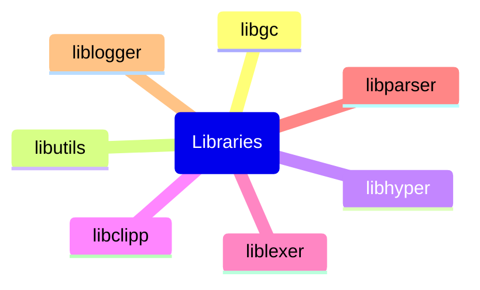

# RefoLibs

A collection of all my libraries :)

# Some tricks

## Cloning

Because sub repositories are in fact link to other repositories as represented by git, Git won't download automatically all the code but just the present repository.
To obtain clones of such repositories some different steps are needed:

- `git clone --recurse-submodules git@github.com:frefolli/refolibs` clones the repo and with that all the submodules
- `git submodule init && git submodule update` clones the submodules if you did cloned this repo normally

## Contributing

### 1) Changes to a submodule from this repo

Whenever you make some changes to a submodule, let's say `refolibs/libA`: do your `git status/commit/push` as usual, but then come back to `refolibs` directory and `git status/commit/push` also here because the pointer to sub repository has changed and needs to aligned.

### 2) Changes to a submodule from it's repo

Whenever you make some changes to a submodule, let's say `refolibs/libA`: cd into `refolibs/libA` and do `git pull` as usual, but then come back to `refolibs` directory and `git status/commit/push` also here because the pointer to sub repository has changed and needs to aligned.
